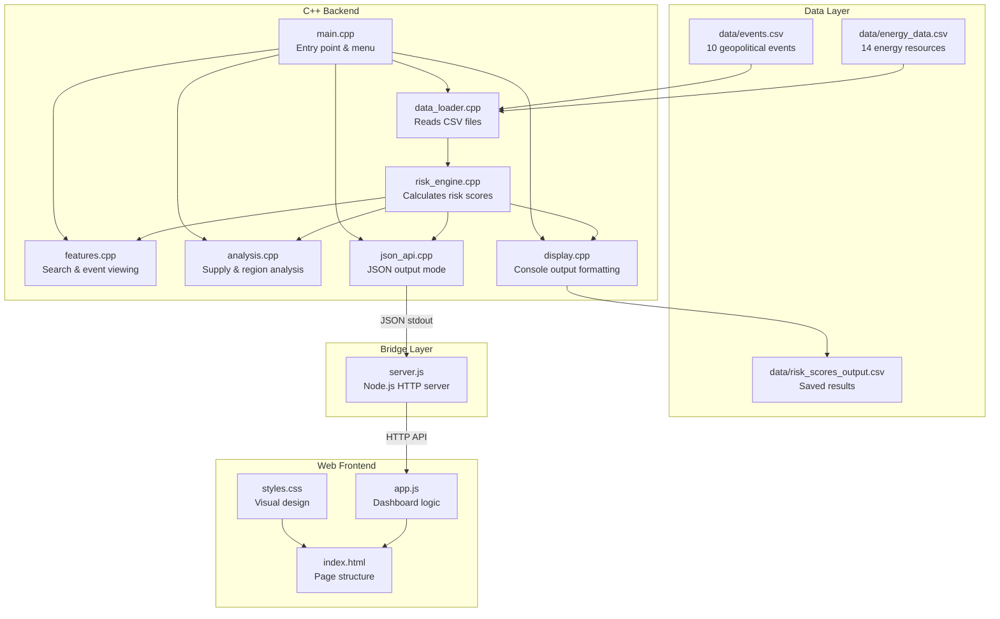

# Global Energy Risk Monitor — Complete Project Walkthrough

> A comprehensive guide explaining every file, every calculation, and how the entire system works end-to-end.

---

## Table of Contents

1. [Project Overview](#1-project-overview)
2. [System Architecture](#2-system-architecture)
3. [Complete File Map](#3-complete-file-map)
4. [Data Files](#4-data-files)
5. [C++ Backend — Core Files](#5-c-backend--core-files)
6. [Risk Calculation Engine — The Math](#6-risk-calculation-engine--the-math)
7. [C++ Feature Modules](#7-c-feature-modules)
8. [JSON API Bridge](#8-json-api-bridge)
9. [Node.js Server](#9-nodejs-server)
10. [Frontend — Web Dashboard](#10-frontend--web-dashboard)
11. [Data Flow — Step by Step](#11-data-flow--step-by-step)
12. [How to Compile & Run](#12-how-to-compile--run)

---

## 1. Project Overview

The **Global Energy Risk Monitor System** is a C++ application that:
- Loads data about **14 global energy resources** (oil, gas, coal, electricity, renewables) and **10 geopolitical events** (wars, sanctions, trade restrictions)
- Calculates a **risk score (0–100)** for each resource using 5 weighted sub-scores
- Classifies each resource as **HIGH**, **MEDIUM**, or **LOW** risk
- Displays results via an **interactive console menu** (C++) and a **web dashboard** (HTML/CSS/JS)

The web frontend does **NOT** replicate any calculations — it calls the C++ backend through a Node.js bridge server.

---

## 2. System Architecture



### Two Modes of Operation

| Mode | How it's triggered | What happens |
|---|---|---|
| **Console Mode** | Run `EnergyRisk.exe` (no flags) | Shows interactive text menu in terminal |
| **JSON API Mode** | Run `EnergyRisk.exe --json <command>` | Outputs JSON to stdout, used by server.js |

---

## 3. Complete File Map

```
EnergyRiskMonitor/
│
├── data/                          ← DATA FILES (CSV)
│   ├── energy_data.csv            ← 14 energy resources (input)
│   ├── events.csv                 ← 10 geopolitical events (input)
│   └── risk_scores_output.csv     ← Calculated results (output)
│
├── main.cpp                       ← ENTRY POINT — menu loop + JSON mode check
├── data_loader.h                  ← Struct definitions (EnergyResource, GeopoliticalEvent)
├── data_loader.cpp                ← CSV file reading and writing
├── risk_engine.h                  ← RiskScore struct definition
├── risk_engine.cpp                ← 5 sub-score functions + calculateRisk()
├── features.h                     ← Search & event function declarations
├── features.cpp                   ← Resource search, event viewing, region filter
├── analysis.h                     ← Analysis function declarations
├── analysis.cpp                   ← Supply disruption & region comparison
├── display.h                      ← Display function declarations
├── display.cpp                    ← Console tables, global summary, bar charts
├── json_api.h                     ← JSON API function declaration
├── json_api.cpp                   ← JSON output for all 7 API endpoints
├── server.js                      ← Node.js bridge server (C++ ↔ Browser)
├── EnergyRisk.exe                 ← Compiled binary
│
└── frontend/                      ← WEB DASHBOARD
    ├── index.html                 ← HTML structure (5 sections)
    ├── styles.css                 ← CSS design (1600+ lines, dark theme)
    └── app.js                     ← JavaScript (fetches data from C++ via API)
```

---

## 4. Data Files

### 4.1 `data/energy_data.csv` — Energy Resources (Input)

Contains **14 global energy resources**. Each row has 9 fields:

| Column | Type | Description | Example |
|---|---|---|---|
| `id` | string | Unique identifier | `OIL_SAU` |
| `name` | string | Full name | `Saudi Crude Oil` |
| `type` | string | Category (Oil/Gas/Coal/Electricity/Renewable) | `Oil` |
| `region` | string | Country or region | `Saudi Arabia` |
| `production` | double | Daily production volume | `12.0` |
| `consumption` | double | Daily consumption volume | `3.5` |
| `reserve_years` | double | Years of reserves remaining | `65` |
| `export_dependency` | double | How much others depend on this (0.0–1.0) | `0.85` |
| `price` | double | Current price in USD | `82.40` |

**All 14 resources:**

| ID | Name | Type | Region |
|---|---|---|---|
| OIL_SAU | Saudi Crude Oil | Oil | Saudi Arabia |
| OIL_RUS | Russian Crude Oil | Oil | Russia |
| GAS_RUS | Russian Natural Gas | Gas | Russia |
| GAS_QAT | Qatari LNG | Gas | Qatar |
| OIL_IRN | Iranian Crude Oil | Oil | Iran |
| OIL_IRQ | Iraqi Crude Oil | Oil | Iraq |
| OIL_USA | US Crude Oil | Oil | USA |
| GAS_NOR | Norwegian Natural Gas | Gas | Norway |
| ELEC_EU | EU Electricity | Electricity | EU |
| COAL_CHN | Chinese Coal | Coal | China |
| OIL_VEN | Venezuelan Oil | Oil | Venezuela |
| GAS_USA | US Natural Gas | Gas | USA |
| OIL_NSE | North Sea Oil | Oil | Norway |
| WIND_NOR | Norwegian Wind Energy | Renewable | Norway |

### 4.2 `data/events.csv` — Geopolitical Events (Input)

Contains **10 geopolitical events**. Each row has 7 fields:

| Column | Type | Description | Example |
|---|---|---|---|
| `id` | string | Unique event ID | `E001` |
| `title` | string | Event name | `Russia-Ukraine War` |
| `type` | string | Category (War/Sanctions/Instability/TradeRestriction/ProductionCut) | `War` |
| `region` | string | Affected country/region | `Russia` |
| `intensity` | double | Severity (0.0 = weak, 1.0 = very severe) | `0.85` |
| `supply_impact` | double | Supply reduction (0.0–1.0) | `0.30` |
| `is_active` | int | 1 = currently happening, 0 = ended | `1` |

**All 10 events (9 active, 1 ended):**

| ID | Title | Type | Region | Active? |
|---|---|---|---|---|
| E001 | Russia-Ukraine War | War | Russia | ✅ |
| E002 | US-Iran Sanctions | Sanctions | Iran | ✅ |
| E003 | OPEC Production Cut | ProductionCut | Saudi Arabia | ✅ |
| E004 | Libyan Political Instability | Instability | Libya | ✅ |
| E005 | Red Sea Trade Disruption | TradeRestriction | Yemen | ✅ |
| E006 | Venezuela Economic Crisis | Instability | Venezuela | ✅ |
| E007 | EU Energy Crisis | TradeRestriction | EU | ✅ |
| E008 | China Coal Import Restrictions | Sanctions | China | ✅ |
| E009 | Iraq Kurdistan Tensions | Instability | Iraq | ✅ |
| E010 | Norway Gas Pipeline Sabotage | War | Norway | ❌ |

### 4.3 `data/risk_scores_output.csv` — Calculated Results (Output)

Generated when the user selects **"Save and Exit"** from the console menu. Contains the calculated risk scores for all 14 resources, written by `saveRiskScores()` in `data_loader.cpp`.

---

## 5. C++ Backend — Core Files

### 5.1 `data_loader.h` — Data Structure Definitions

**This is the most fundamental file.** It defines the two core structs used everywhere:

```cpp
struct EnergyResource {
    string id;                  // e.g., "OIL_SAU"
    string name;                // e.g., "Saudi Crude Oil"
    string type;                // Oil, Gas, Coal, Electricity, Renewable
    string region;              // e.g., "Saudi Arabia"
    double production;          // Daily production volume
    double consumption;         // Daily consumption volume
    double reserve_years;       // Years of reserves remaining
    double export_dependency;   // 0.0 to 1.0
    double price;               // Current price in USD
};

struct GeopoliticalEvent {
    string id;                  // e.g., "E001"
    string title;               // e.g., "Russia-Ukraine War"
    string type;                // War, Sanctions, Instability, etc.
    string region;              // Affected region
    double intensity;           // 0.0 to 1.0
    double supply_impact;       // 0.0 to 1.0
    int is_active;              // 1 = active, 0 = ended
};
```

**Functions declared:**
- `loadEnergyResources(filename)` → reads CSV into `vector<EnergyResource>`
- `loadEvents(filename)` → reads CSV into `vector<GeopoliticalEvent>`
- `saveRiskScores(scores, filename)` → writes results to CSV

### 5.2 `data_loader.cpp` — CSV File I/O

**What it does:** Reads CSV files line-by-line using `ifstream` and `stringstream`.

**Key functions:**

| Function | Purpose | Called by |
|---|---|---|
| `loadEnergyResources("data/energy_data.csv")` | Reads 14 resources from CSV, parses each field, returns a vector | `main()` at startup |
| `loadEvents("data/events.csv")` | Reads 10 events from CSV, parses each field, returns a vector | `main()` at startup |
| `saveRiskScores(scores, "data/risk_scores_output.csv")` | Writes calculated scores to output CSV | Menu option 6 (Save & Exit) |

**How CSV parsing works:**
1. Opens file with `ifstream`
2. Skips header row with `getline(file, line)`
3. For each remaining line, splits by comma using `getline(ss, token, ',')`
4. Converts numeric strings with `stod()` and `stoi()`
5. Pushes each parsed struct into a vector

### 5.3 `risk_engine.h` — Risk Score Structure

Defines the `RiskScore` struct:

```cpp
struct RiskScore {
    string resource_id;         // Which resource this score belongs to
    string resource_name;       // Human-readable name
    string region;              // Region
    string level;               // "HIGH", "MEDIUM", or "LOW"
    double raw_score;           // Final weighted score (0–100)
    double supply_score;        // Sub-score 1 (weight: 30%)
    double conflict_score;      // Sub-score 2 (weight: 25%)
    double trade_score;         // Sub-score 3 (weight: 20%)
    double demand_score;        // Sub-score 4 (weight: 15%)
    double route_score;         // Sub-score 5 (weight: 10%)
};
```

**Function declared:**
- `calculateRisk(resource, events)` → returns a fully populated `RiskScore`

---

## 6. Risk Calculation Engine — The Math

### 6.1 `risk_engine.cpp` — The 5 Sub-Scores

This is the **heart of the system**. It contains 5 sub-score functions and 1 main function.

---

#### Sub-Score 1: `calcSupplyScore()` — Weight: **30%**

**What it measures:** How much consumption exceeds production.

**Formula:**
```
If production ≤ 0 → return 100 (total supply failure)

ratio = consumption / production
score = ((ratio - 0.8) / 0.7) × 100
Clamp between 0 and 100
```

**How it works:**
- Risk starts rising when consumption/production ratio exceeds **0.8**
- At ratio 1.5 (consumption = 1.5× production), score = 100
- Example: US Crude Oil has production=13.2, consumption=19.8
  - ratio = 19.8/13.2 = 1.5 → score = **100** (max supply risk!)

---

#### Sub-Score 2: `calcConflictScore()` — Weight: **25%**

**What it measures:** Risk from wars and political instability in the resource's region.

**Formula:**
```
For each active event in the SAME region:
    If event type is "War" or "Instability":
        total += intensity × 100
Clamp at 100
```

**How it works:**
- Only counts events that are **active** (`is_active == 1`) and in the **same region**
- Only counts **War** and **Instability** type events (NOT sanctions or trade restrictions)
- Example: Russian Crude Oil, region = Russia
  - Event E001 (Russia-Ukraine War): type=War, intensity=0.85 → adds 85
  - Conflict score = **85**

---

#### Sub-Score 3: `calcTradeScore()` — Weight: **20%**

**What it measures:** Risk from trade sanctions and restrictions.

**Formula:**
```
For each active event in the SAME region:
    If event type is "Sanctions" or "TradeRestriction":
        total += intensity × 100
Clamp at 100
```

**How it works:**
- Same logic as conflict score, but only counts **Sanctions** and **TradeRestriction** types
- Example: Iranian Crude Oil, region = Iran
  - Event E002 (US-Iran Sanctions): type=Sanctions, intensity=0.70 → adds 70
  - Trade score = **70**

---

#### Sub-Score 4: `calcDemandScore()` — Weight: **15%**

**What it measures:** Risk from high export dependency and low reserves.

**Formula:**
```
score = export_dependency × 50

If reserve_years < 30:
    score += ((30 - reserve_years) / 30) × 50

Clamp at 100
```

**How it works:**
- Base score from how dependent the world is on this resource's exports
- Additional penalty if reserves will run out in less than 30 years
- Example: North Sea Oil: export_dependency=0.88, reserve_years=20
  - Base: 0.88 × 50 = 44
  - Penalty: ((30-20)/30) × 50 = 16.67
  - Demand score = **60.67**

---

#### Sub-Score 5: `calcRouteScore()` — Weight: **10%**

**What it measures:** Geographic vulnerability of supply routes.

**Lookup table (hardcoded):**

| Region | Route Score |
|---|---|
| Russia | 60 |
| Iran | 55 |
| Libya | 50 |
| Yemen | 50 |
| Venezuela | 45 |
| Iraq | 40 |
| Saudi Arabia | 15 |
| All others | 10 |

---

#### Main Function: `calculateRisk()`

**Combines all 5 sub-scores using weighted formula:**

```
raw_score = supply × 0.30
          + conflict × 0.25
          + trade × 0.20
          + demand × 0.15
          + route × 0.10
```

**Risk Level Classification:**

| Score Range | Level |
|---|---|
| > 66 | **HIGH** |
| > 33 | **MEDIUM** |
| ≤ 33 | **LOW** |

**Example Calculation — Russian Crude Oil:**

| Sub-Score | Value | Weight | Contribution |
|---|---|---|---|
| Supply | 0.00 | × 0.30 | = 0.00 |
| Conflict | 85.00 | × 0.25 | = 21.25 |
| Trade | 0.00 | × 0.20 | = 0.00 |
| Demand | 39.33 | × 0.15 | = 5.90 |
| Route | 60.00 | × 0.10 | = 6.00 |
| | | **Total** | **= 33.15** |
| | | **Level** | **MEDIUM** |

---

## 7. C++ Feature Modules

### 7.1 `features.cpp` — Resource Lookup & Event Viewing

| Function | Menu Option | What it does |
|---|---|---|
| `searchResource()` | Option 2 | Prompts user for name/ID, searches resources, displays full risk assessment if found |
| `showActiveEvents()` | Option 3 | Lists all events where `is_active == 1`, shows title, type, region, intensity%, impact% |
| `showEventsForRegion()` | Option 3 (sub) | Filters active events by a user-specified region name |

### 7.2 `analysis.cpp` — Supply & Region Analysis

| Function | Menu Option | What it does |
|---|---|---|
| `analyzeSupplyDisruption()` | Option 4 | Calculates risk for all resources, sorts by `supply_score` descending, shows which events cause disruption |
| `compareRegionRisk()` | Option 4 | Groups resources by region, calculates average `raw_score` per region, sorts and displays a comparison table |

### 7.3 `display.cpp` — Console Output Formatting

| Function | Menu Option | What it does |
|---|---|---|
| `printRiskTable()` | Option 1 | Displays all resources sorted by risk score in a formatted table |
| `displayGlobalSummary()` | Option 5 | Shows total resources, global average, active events count, risk distribution bar chart (using `=` characters), and top 3 highest-risk resources |
| `printRiskLabel()` | Used internally | Formats risk levels: `[!! HIGH !!]`, `[~ MEDIUM ~]`, `[  LOW  ]` |

### 7.4 `main.cpp` — Entry Point & Menu Loop

**What it does:**
1. Checks for `--json` flag → if present, routes to `json_api.cpp` and exits
2. Otherwise, displays welcome banner
3. Loads data from CSV files using `data_loader.cpp`
4. Runs the interactive menu loop with 6 options:

| Option | Action | Module Called |
|---|---|---|
| 1 | View all resources and risk scores | `display.cpp` → `printRiskTable()` |
| 2 | Search for a resource by name | `features.cpp` → `searchResource()` |
| 3 | View active geopolitical events | `features.cpp` → `showActiveEvents()` |
| 4 | Compare regions by risk | `analysis.cpp` → `analyzeSupplyDisruption()` + `compareRegionRisk()` |
| 5 | View global risk summary | `display.cpp` → `displayGlobalSummary()` |
| 6 | Save results and exit | `data_loader.cpp` → `saveRiskScores()` |

---

## 8. JSON API Bridge

### 8.1 `json_api.h` / `json_api.cpp` — JSON Output Mode

**Purpose:** When `EnergyRisk.exe` is run with `--json <command>`, instead of showing the interactive menu, it outputs structured JSON to stdout and exits.

**Key function:** `handleJsonApi(argc, argv)` — returns `true` if `--json` was present.

**7 API commands and what they output:**

| Command | C++ Functions Used | JSON Output |
|---|---|---|
| `--json dashboard` | `loadEnergyResources()` + `loadEvents()` + `calculateRisk()` for all | Stats object + sorted risk scores array + active events array |
| `--json resources` | Same + merge resource data with risk scores | Array of resource objects, each with nested risk object |
| `--json events` | `loadEvents()` | Array of all event objects |
| `--json regions` | `calculateRisk()` for all + group by region + calculate averages | Array of region objects with avg score, count, level |
| `--json analysis` | `calculateRisk()` for all + sort two ways | Breakdown array (by score) + supply ranking array (by supply_score) |
| `--json search <query>` | `loadEnergyResources()` + partial name match + `calculateRisk()` | Array of matching {resource, risk} pairs |
| `--json resource <id>` | Find by ID + `calculateRisk()` + find related events | Single {resource, risk, related_events} object |

**Helper functions:**
- `jsonEscape()` — escapes special characters for JSON strings
- `fmtDouble()` — formats numbers to fixed decimal places
- `resourceToJson()` — serializes an `EnergyResource` struct to JSON
- `eventToJson()` — serializes a `GeopoliticalEvent` struct to JSON
- `riskScoreToJson()` — serializes a `RiskScore` struct to JSON

---

## 9. Node.js Server

### 9.1 `server.js` — HTTP Bridge Server

**Purpose:** Acts as a bridge between the web browser and the C++ backend. The browser can't execute `.exe` files directly, so this server:
1. Listens for HTTP requests on port **3000**
2. For API requests, runs `EnergyRisk.exe --json <command>` as a child process
3. Captures the JSON from stdout
4. Sends it back to the browser as an HTTP JSON response
5. For non-API requests, serves static files from the `frontend/` folder

**API endpoint routing:**

| HTTP Request | Executes |
|---|---|
| `GET /api/dashboard` | `EnergyRisk.exe --json dashboard` |
| `GET /api/resources` | `EnergyRisk.exe --json resources` |
| `GET /api/events` | `EnergyRisk.exe --json events` |
| `GET /api/regions` | `EnergyRisk.exe --json regions` |
| `GET /api/analysis` | `EnergyRisk.exe --json analysis` |
| `GET /api/search?q=oil` | `EnergyRisk.exe --json search oil` |
| `GET /api/resource/OIL_RUS` | `EnergyRisk.exe --json resource OIL_RUS` |
| `GET /health` | Returns `{"status":"ok"}` (no C++ needed) |
| `GET /` | Serves `frontend/index.html` |
| `GET /styles.css` | Serves `frontend/styles.css` |
| `GET /app.js` | Serves `frontend/app.js` |

**Key function: `runCppBackend(args)`**
- Uses Node.js `child_process.execFile()` to run the C++ exe
- Sets working directory to the project root (so `data/` paths resolve)
- 10-second timeout, 1MB output buffer
- Parses stdout, skips non-JSON lines (like "Successfully loaded…"), finds the JSON object
- Returns parsed JSON as a JavaScript object

---

## 10. Frontend — Web Dashboard

### 10.1 `frontend/index.html` — Page Structure

A single-page app with **5 sections** (only one visible at a time):

| Section ID | Title | What it shows |
|---|---|---|
| `dashboard` | (default) | Stats cards, donut chart, bar chart, top risks, events feed |
| `resources` | Energy Resources | Filterable/sortable table of all resources with risk scores |
| `events` | Geopolitical Events | Card grid of all 10 events with intensity bars |
| `regions` | Region Comparison | Region cards + bar chart ranking regions by avg risk |
| `analysis` | Supply Disruption Analysis | Full risk breakdown table + supply disruption ranking |

**Key HTML elements:**
- **Navbar:** Brand logo, 5 navigation links, search box, export button, C++ backend status badge
- **Stats grid:** 4 stat cards (resources count, active events, risk index, high risk count)
- **Modal:** Overlay popup showing detailed resource info when clicking a row
- **Backend badge:** Shows green "C++ Backend" when connected, yellow "Connecting...", or red "Disconnected"

### 10.2 `frontend/styles.css` — Visual Design (1614 lines)

Premium dark theme with glassmorphism effects. Key design features:

| Feature | Implementation |
|---|---|
| **Dark theme** | `--bg-primary: #0a0e1a`, dark blue-black backgrounds |
| **Glassmorphism** | `backdrop-filter: blur(20px)`, semi-transparent cards |
| **Animated particles** | CSS `@keyframes particleFloat`, 20 floating dots |
| **Risk level colors** | Red (#ef4444) = HIGH, Amber (#f59e0b) = MEDIUM, Green (#22c55e) = LOW |
| **Bar animations** | Width transition from 0% to actual with `cubic-bezier` easing |
| **Hover effects** | Cards lift on hover (`translateY(-3px)`), glow shadows |
| **Typography** | Inter font (Google Fonts) for text, JetBrains Mono for numbers |
| **Responsive grid** | CSS Grid for stats (4 columns), charts (2 columns), regions |

### 10.3 `frontend/app.js` — Dashboard Logic (No Calculations!)

**Critical point:** This file contains **ZERO risk calculations**. Every piece of data comes from `fetch()` calls to the server, which executes C++.

**Key functions and their API calls:**

| Function | Fetches | Renders |
|---|---|---|
| `renderDashboard()` | `GET /api/dashboard` | Stats, donut chart, bar chart, top risks, events feed |
| `renderResourcesTable()` | `GET /api/resources` | Filterable/sortable table |
| `renderEventsGrid()` | `GET /api/events` | Event cards grid |
| `renderRegions()` | `GET /api/regions` | Region cards + bar rankings |
| `renderAnalysis()` | `GET /api/analysis` | Breakdown table + supply ranking |
| `showResourceModal(id)` | `GET /api/resource/<id>` | Detailed popup with all sub-scores |
| `setupSearch()` | `GET /api/search?q=<query>` | Live search dropdown (250ms debounce) |
| `setupExport()` | `GET /api/dashboard` | Downloads CSV generated from C++ data |

**Utility functions (visual only, no calculations):**
- `animateCounter()` — Animates numbers counting up (ease-out cubic)
- `createParticles()` — Creates 20 floating background dots
- `getScoreColor()` — Returns red/amber/green CSS color based on score value
- `updateConnectionStatus()` — Updates the "C++ Backend" badge in navbar
- `showLoading()` / `showError()` — Loading spinner and error messages

---

## 11. Data Flow — Step by Step

### When user opens http://localhost:3000:

```
Step 1: Browser requests GET /
Step 2: server.js serves frontend/index.html
Step 3: Browser loads styles.css and app.js

Step 4: app.js DOMContentLoaded fires
Step 5: app.js calls renderDashboard()
Step 6: app.js does fetch('/api/dashboard')

Step 7: server.js receives the request
Step 8: server.js runs: EnergyRisk.exe --json dashboard

Step 9:  C++ main() detects --json flag
Step 10: C++ handleJsonApi() is called
Step 11: C++ loadEnergyResources("data/energy_data.csv") → reads 14 resources
Step 12: C++ loadEvents("data/events.csv") → reads 10 events
Step 13: C++ calculateRisk() runs for each of the 14 resources
         → Each call computes 5 sub-scores using the formulas
         → Combines with weighted formula
         → Classifies as HIGH/MEDIUM/LOW
Step 14: C++ apiDashboard() builds JSON string
Step 15: C++ prints JSON to stdout and exits

Step 16: server.js captures stdout
Step 17: server.js parses JSON, sends HTTP 200 response
Step 18: app.js receives JSON data
Step 19: app.js renders stats, charts, tables, events
Step 20: User sees the dashboard with live C++ calculations
```

### When user clicks a resource row:

```
Step 1: app.js calls showResourceModal('OIL_RUS')
Step 2: Modal shows "Fetching from C++ backend..." spinner
Step 3: app.js does fetch('/api/resource/OIL_RUS')
Step 4: server.js runs: EnergyRisk.exe --json resource OIL_RUS
Step 5: C++ loads data, finds OIL_RUS, calculates its risk
Step 6: C++ finds related events (Russia-Ukraine War)
Step 7: C++ outputs JSON with resource + risk + events
Step 8: app.js receives data, renders modal with all sub-scores
```

### When user searches:

```
Step 1: User types "oil" in search box
Step 2: After 250ms debounce, app.js fetches /api/search?q=oil
Step 3: server.js runs: EnergyRisk.exe --json search oil
Step 4: C++ does case-insensitive partial match on all resource names
Step 5: Finds 7 matches (all resources with "oil" in name)
Step 6: Calculates risk for each match
Step 7: Returns JSON with results
Step 8: app.js shows dropdown with matched resources
```

---

## 12. How to Compile & Run

### Step 1: Compile C++ (include all files)

```bash
g++ -o EnergyRisk.exe main.cpp data_loader.cpp risk_engine.cpp features.cpp analysis.cpp display.cpp json_api.cpp -std=c++11
```

### Step 2: Test C++ JSON mode (optional)

```bash
# Test dashboard output
./EnergyRisk.exe --json dashboard

# Test search
./EnergyRisk.exe --json search oil

# Test single resource
./EnergyRisk.exe --json resource OIL_RUS
```

### Step 3: Start the web server

```bash
node server.js
```

### Step 4: Open the dashboard

Open **http://localhost:3000** in a browser.

### Console mode still works

```bash
# Run without --json for the original interactive menu
./EnergyRisk.exe
```

---

> [!IMPORTANT]
> **The frontend (app.js) does NOT contain any risk formulas or calculations.** Every number displayed in the dashboard is computed by the C++ code in `risk_engine.cpp` and delivered through `json_api.cpp` → `server.js` → `fetch()`.

---

## Team Member Responsibilities

| Member | Role | Files |
|---|---|---|
| Member 1 | Team Leader + Main Menu + Data Files | `main.cpp`, `data/energy_data.csv`, `data/events.csv` |
| Member 2 | Data Manager — File Reading and Writing | `data_loader.h`, `data_loader.cpp` |
| Member 3 | Risk Engineer — Score Calculator | `risk_engine.h`, `risk_engine.cpp` |
| Member 4 | Feature Builder A — Resource Lookup and Events | `features.h`, `features.cpp` |
| Member 5 | Feature Builder B — Supply Analysis and Region Comparison | `analysis.h`, `analysis.cpp` |
| Member 6 | Display Engineer — Output Formatting and Summary | `display.h`, `display.cpp` |
| (Shared) | Web Integration | `json_api.h`, `json_api.cpp`, `server.js`, `frontend/*` |
